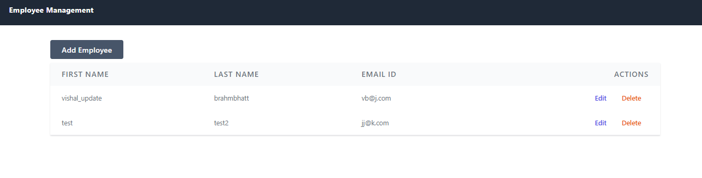
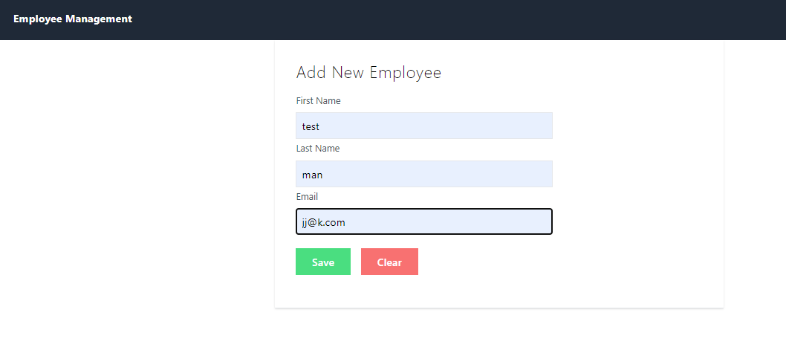
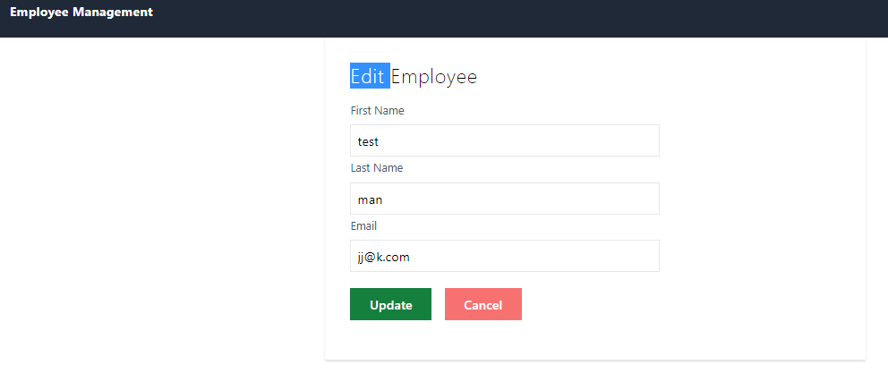

# CRUD APP with Spring:Boot-JPA  & React JS

I have created this Simple and Small CRUD Application with help of spring-JPA as backend and React for front-end.

#### Features used :
 - Hooks (useEffect, useState,useNavigate, etc)
 - JPA (for DB Connections and manipulations)
 - Service and Components Folders for simplicity of connection
 
Please check out below screenshots for better understanding.

## Screenshots

- Home

- Add New User Page

- Edit User Page

### Technologies used :

 - React
 - HTML/ tailwind CSS
 - States / JPA
 
